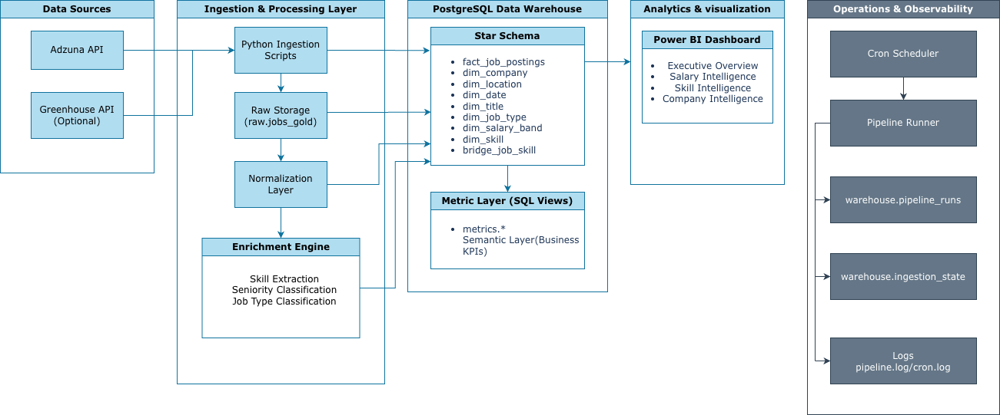
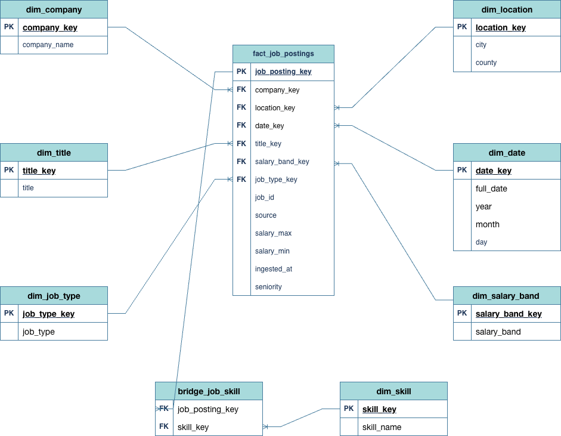

# Job Market Intelligence Platform (Python + PostgreSQL + Power BI)

End-to-end analytics engineering project that ingests job postings, normalizes data across sources, loads a star-schema warehouse in PostgreSQL, enriches records (skills, seniority, job type), publishes metrics as SQL views, and serves an executive Power BI dashboard. The pipeline runs daily via cron with observability and incremental ingestion state tracking.

---

## Key Features

- Medallion-style pipeline (Raw → Normalized → Canonical → Warehouse → Metrics)
- Star schema warehouse with dimensional modeling
- Skill bridge table supporting many-to-many relationships
- Incremental ingestion using `warehouse.ingestion_state`
- Pipeline observability via `warehouse.pipeline_runs`
- SQL analytics layer inside `metrics` schema
- Power BI executive dashboard (multi-page analytics)
- Automated daily pipeline using cron
- Structured logging and monitoring

---

## Architecture

The platform follows a layered data architecture:

API Sources  
↓  
Python Ingestion  
↓  
Raw Data Layer  
↓  
Normalized Transformation Layer  
↓  
Canonical Job Dataset  
↓  
PostgreSQL Data Warehouse  
↓  
Metrics Views  
↓  
Power BI Dashboard

---

## Data Pipeline

The pipeline processes job postings through multiple transformation stages.

### Raw Layer
Job postings are fetched from external APIs (Adzuna, Greenhouse) and stored as raw JSON files.

### Normalized Layer
Source-specific data is standardized using JSON contracts to ensure schema consistency.

### Canonical Layer
Records from multiple sources are unified into a single canonical job dataset.

### Warehouse Layer
Canonical job data is loaded into a PostgreSQL dimensional warehouse.

### Metrics Layer
Aggregated SQL views produce analytics-ready datasets for reporting.

---

## Data Warehouse

The warehouse follows dimensional modeling principles.

### Fact Table
- `fact_jobs`

### Dimension Tables
- `dim_company`
- `dim_location`
- `dim_time`
- `dim_skills`

### Bridge Table
- `bridge_job_skills`

This design enables efficient analytics queries and dashboard reporting.

---

## Tech Stack

### Languages
- Python
- SQL

### Data Engineering
- ETL pipelines
- Medallion architecture (Raw → Normalized → Canonical)

### Database
- PostgreSQL

### Analytics
- Power BI

### Infrastructure
- Cron scheduling
- Structured logging
- Incremental pipeline state tracking

---

## Repository Structure

job-market-intelligence/
│
├── pipelines/              # Pipeline orchestration
├── scripts/                # Ingestion and transformation scripts
├── tasks/                  # Warehouse loading and validation tasks
├── contracts/              # JSON data validation contracts
├── common/                 # Shared utilities and configuration
├── docs/                   # Architecture and system documentation
├── data_samples/           # Example raw datasets
├── logs/                   # Pipeline logs
└── README.md

---

## Pipeline Observability

The pipeline records execution metrics for monitoring and reliability.

Table: `warehouse.pipeline_runs`

Tracked metrics include:
- pipeline run status
- execution duration
- record counts
- data freshness
- anomaly detection

This enables basic pipeline monitoring and debugging.

---

## Example Analytics

The analytics layer generates insights such as:

- Top hiring companies
- Job posting trends over time
- Skill demand analysis
- Location-based hiring trends
- Job seniority distribution

These metrics power the Power BI dashboard.

---

## Dashboard

The Power BI dashboard provides executive-level insights including:

- Hiring trends by company
- Job market demand by location
- Top requested skills
- Role seniority distribution
- Job posting growth trends

---

## Setup

Clone the repository:
git clone https://github.com/anandh-analytics/job-market-intelligence.git
cd job-market-intelligence

Install dependencies:
pip install -r requirements.txt

Configure environment variables:
cp .env.example .env

Run the pipeline:
python -m pipelines.job_market_pipeline

---

## Documentation

Detailed system documentation is available in the `/docs` folder.

- Architecture → `docs/ARCHITECTURE.md`
- Data Flow → `docs/DATA_FLOW.md`
- Warehouse Schema → `docs/WAREHOUSE_SCHEMA.md`
- Operations Guide → `docs/OPERATIONS.md`

---

## Future Improvements

Potential enhancements include:

- Airflow orchestration for scheduling
- Cloud deployment (AWS / GCP)
- Streaming job ingestion
- Automated data quality monitoring
- Additional job data sources

---

## Author

## Anandhageethan Thamizharasan
Data Analytics & Data Engineering Projects
